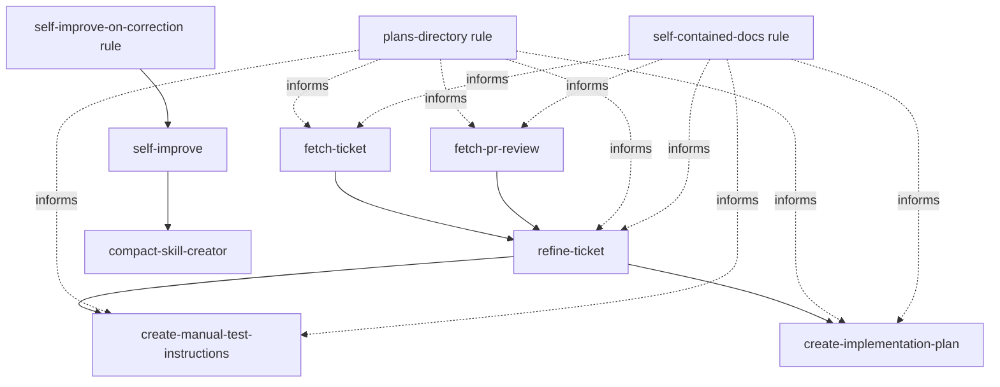

# agent-toolkit

My own toolkit for AI Agentic Coding: a collection of reusable, project-agnostic tools that I use
across multiple projects.

- **Rules**: generic behavioral rules I apply at user level across all projects. Each file in
  [`rules/`](rules) is a single, self-contained rule.
- **Skills**: skills I reuse across projects. Each lives in its own directory under
  [`skills/`](skills) with a `SKILL.md` describing its trigger, allowed tools, and steps.

## Quick Install / Update

Install in one command:

```sh
git clone https://github.com/FrancescoBorzi/agent-toolkit.git && cd agent-toolkit && ./install.sh
```

Update in one command:

```sh
cd agent-toolkit && git pull && ./install.sh
```

## Install via symlinks

[`install.sh`](install.sh) symlinks every rule and skill from this repo into your user's config.

This means the skills and rules will automatically be available in all your projects without
copying files around.

By default rules go to `~/.claude/rules` and skills to `~/.claude/skills`, but you can easily
override this.

First clone the repo (or your own fork):

```sh
git clone https://github.com/FrancescoBorzi/agent-toolkit.git && cd agent-toolkit
```

Then you can run:

```sh
./install.sh
```

This will link all rules and all skills. To customize, use the options below:

```sh
./install.sh --rules-only            # link rules only
./install.sh --skills-only           # link skills only
./install.sh --skills-dir DIR        # custom skills destination (e.g. a project's .claude/skills)
./install.sh --rules-dir DIR         # custom rules destination
./install.sh --force                 # overwrite existing files/symlinks
./install.sh --help
```

Each rule and skill is linked individually.

You can also skip the script and symlink just the ones you want by hand:

```sh
ln -s "$(pwd)/rules/no-nonsense-comments.md" ~/.claude/rules/
ln -s "$(pwd)/skills/run-nx-checks"          ~/.claude/skills/
```

Start a new session and run `/context` to confirm everything is loaded. Rules and skills apply at
the user level (all projects); to scope them to one project, symlink into that repo's
`.claude/rules/` or `.claude/skills/` instead.

## Install with agentwheel

[agentwheel](https://github.com/NestDevLab/agentwheel) installs this repo's rules **and** skills
into your agent and keeps them in sync across Claude, Codex, Copilot, and other runtimes, from
one source. This repo ships an [`openpack.json`](openpack.json) manifest, so it's a first-class
OpenPack package (requires agentwheel ≥ 0.9.0). Run it from where you want it installed (`~` for
user level, or a project root):

```sh
npx agentwheel install github:FrancescoBorzi/agent-toolkit --adapter claude
```

Swap `--adapter claude` for `codex`, `copilot`, etc. to target other agents. For dry runs,
tracking updates, named targets, profiles, or more controlled `add` → `plan` → `install` flows,
see the [agentwheel documentation](https://github.com/NestDevLab/agentwheel).

Only want specific pieces instead of everything? Select them by `<type>/<name>`, for example one
skill plus one rule:

```sh
npx agentwheel install github:FrancescoBorzi/agent-toolkit --adapter claude \
  --select skills/run-nx-checks,rules/no-nonsense-comments.md
```

`--select` is repeatable or comma-separated.

The manifest also marks hard internal dependencies. For example, selecting `skills/self-improve`
also installs `skills/compact-skill-creator`, and selecting
`rules/self-improve-on-correction.md` also installs `skills/self-improve`.

## Artifact relationships

Some skills and rules form a workflow or rely on each other. Hard dependencies are encoded in
[`openpack.json`](openpack.json); suggested next steps remain documented in the skill text.



## Install skills via skills.sh

You can also use the [skills.sh](https://skills.sh/) installer to install the skills from this repo:

```sh
npx skills add FrancescoBorzi/agent-toolkit
```
