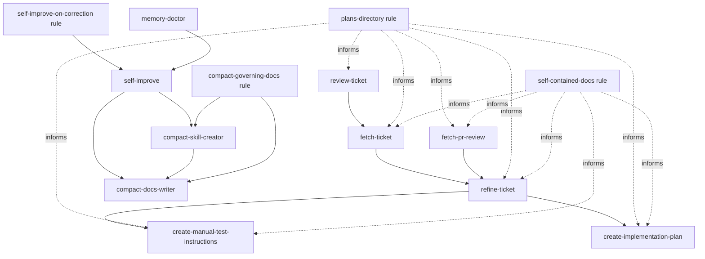

# agent-toolkit

A collection of project-agnostic, generic agentic tools for common engineering tasks.

Designed to work with any kind of AI agent on any kind of software development project.

## Skills

Agentic skills I use across all my software engineering projects — solo or in a team.

Not bound to any specific language or framework.

### Skill & doc authoring

The tools I use to create and continuously improve the skills and docs my agents rely on —
following [my approach to agentic skills](https://medium.com/engineering-in-the-age-of-ai/my-approach-to-agentic-skills-e08dc6c0d1cd),
I improve the behavior of my agents literally every day.

- **[compact-docs-writer](./skills/compact-docs-writer/SKILL.md)** — write docs with maximum token
  economy.
- **[compact-skill-creator](./skills/compact-skill-creator/SKILL.md)** — create or edit skills,
  keeping them lean and efficient.
- **[self-improve](./skills/self-improve/SKILL.md)** — capture a lesson into the skill or doc that
  governs it, so mistakes aren't repeated and agents keep getting better at the project.

### Context & memory hygiene

Maintenance to run from time to time, keeping your setup tidy and your context sharp.

- **[context-checkup](./skills/context-checkup/SKILL.md)** — audit what auto-loads into a
  session's context and spot what can be trimmed to reduce startup tokens.
  [Why this is important](https://medium.com/engineering-in-the-age-of-ai/keep-your-ai-agents-context-window-sharp-7255d83a8949).
- **[memory-doctor](./skills/memory-doctor/SKILL.md)** — clean up the memory your agents keep
  auto-accumulating, moving the relevant parts to the right place.
  [More about this](https://medium.com/engineering-in-the-age-of-ai/keep-your-ai-agents-memory-clean-and-organized-with-memory-doctor-a79f7174f257).

### Task workflow

My daily routine for any programming task, following the
[RPA workflow](https://medium.com/engineering-in-the-age-of-ai/the-refine-plan-act-pattern-for-agentic-ai-coding-59ee013e4427):
fetch a ticket, refine it, plan it, then let a fresh session execute it.

- **[fetch-ticket](./skills/fetch-ticket/SKILL.md)** — download a ticket from any tracker
  (e.g. GitHub, Jira, Azure DevOps) and save it as a self-contained markdown file.
- **[refine-ticket](./skills/refine-ticket/SKILL.md)** — define the "what" of a task: validate the
  ticket against the codebase, settle open decisions together, and save a
  self-contained requirements doc a fresh session can pick up.
- **[create-implementation-plan](./skills/create-implementation-plan/SKILL.md)** — define the
  "how" of a task: turn the requirements into an implementation plan, settling the technical
  decisions together, then save it for a fresh session to execute.
- **[create-manual-test-instructions](./skills/create-manual-test-instructions/SKILL.md)** —
  derive manual test steps from a ticket or requirements file, useful for the developer or QA.

### Review assistants

Powerful review helpers that are able to quickly check the codebase when assisting with code or
ticket reviews.

- **[fetch-pr-review](./skills/fetch-pr-review/SKILL.md)** — collect the comments left by other
  reviewers on your PR and save them into a markdown doc, ready to address (or push back on), for
  example via refine-ticket.
- **[review-code-assistant](./skills/review-code-assistant/SKILL.md)** — assist you in reviewing a
  PR or branch.
- **[review-ticket](./skills/review-ticket/SKILL.md)** — triage a ticket before anyone picks it
  up, spotting decisions to raise with the team.
- **[fresh-eyes-review](./skills/fresh-eyes-review/SKILL.md)** — let an agent with a fresh
  perspective review a changeset and report its findings back to the main session.

### Code checks

- **[run-nx-checks](./skills/run-nx-checks/SKILL.md)** — run format, lint, test, and build on the
  affected projects of an Nx workspace and fix unambiguous failures.

## Rules

A set of generic, project-agnostic, opinionated rules that apply to any codebase.

- **[compact-governing-docs](./rules/compact-governing-docs.md)** — run the matching compaction
  skill before writing or editing a governing doc, so it stays compact.
- **[git-read-only-by-default](./rules/git-read-only-by-default.md)** — never commit, push, merge,
  or otherwise write to git without an explicit instruction.
- **[no-ai-attribution](./rules/no-ai-attribution.md)** — no AI co-author trailers on commits and
  no "Generated with" footers on PRs.
- **[no-nonsense-comments](./rules/no-nonsense-comments.md)** — write only code comments that
  still make sense to a future reader with zero context, prefer no comment over a low-value one.
- **[plans-directory](./rules/plans-directory.md)** — structure save plans and similar documents under
  the project's planning directory.
- **[self-contained-docs](./rules/self-contained-docs.md)** — keep planning and design docs
  concise and executable by a fresh session with no prior context.
- **[self-improve-on-correction](./rules/self-improve-on-correction.md)** — when the user corrects
  something a skill or doc governs, offer to persist the lesson via
  [self-improve](./skills/self-improve/SKILL.md).
- **[write-realistic-texts](./rules/write-realistic-texts.md)** — make user-facing text sound 
  natural, no AI-generated nonsense.

## How to install

### Quick Install / Update

Install in one command:

```sh
git clone https://github.com/FrancescoBorzi/agent-toolkit.git && cd agent-toolkit && ./install.sh
```

Update in one command:

```sh
cd agent-toolkit && git pull && ./install.sh
```

### Install via symlinks

[`install.sh`](install.sh) symlinks every rule and skill from this repo into your user's config.

This means the skills and rules will automatically be available in all your projects without
copying files around.

By default rules go to `~/.claude/rules` and skills to `~/.claude/skills`, but you can easily
override this.

First clone the repo (or your own fork):

```sh
git clone https://github.com/FrancescoBorzi/agent-toolkit.git && cd agent-toolkit
```

Then you can run:

```sh
./install.sh
```

This will link all rules and all skills. To customize, use the options below:

```sh
./install.sh --rules-only            # link rules only
./install.sh --skills-only           # link skills only
./install.sh --skills-dir DIR        # custom skills destination (e.g. a project's .claude/skills)
./install.sh --rules-dir DIR         # custom rules destination
./install.sh --force                 # overwrite existing files/symlinks
./install.sh --help
```

Each rule and skill is linked individually.

You can also skip the script and symlink just the ones you want by hand:

```sh
ln -s "$(pwd)/rules/no-nonsense-comments.md" ~/.claude/rules/
ln -s "$(pwd)/skills/run-nx-checks"          ~/.claude/skills/
```

Start a new session and run `/context` to confirm everything is loaded. Rules and skills apply at
the user level (all projects); to scope them to one project, symlink into that repo's
`.claude/rules/` or `.claude/skills/` instead.

### Install with agentwheel

[agentwheel](https://github.com/NestDevLab/agentwheel) installs this repo's rules **and** skills
into your agent and keeps them in sync across Claude, Codex, Copilot, and other runtimes, from
one source. This repo ships an [`openpack.json`](openpack.json) manifest, so it's a first-class
OpenPack package (requires agentwheel ≥ 0.9.0). Run it from where you want it installed (`~` for
user level, or a project root):

```sh
npx agentwheel install github:FrancescoBorzi/agent-toolkit --adapter claude
```

Swap `--adapter claude` for `codex`, `copilot`, etc. to target other agents. For dry runs,
tracking updates, named targets, profiles, or more controlled `add` → `plan` → `install` flows,
see the [agentwheel documentation](https://github.com/NestDevLab/agentwheel).

Only want specific pieces instead of everything? Select them by `<type>/<name>`, for example one
skill plus one rule:

```sh
npx agentwheel install github:FrancescoBorzi/agent-toolkit --adapter claude \
  --select skills/run-nx-checks,rules/no-nonsense-comments.md
```

`--select` is repeatable or comma-separated.

The manifest also marks hard internal dependencies. For example, selecting
`skills/compact-skill-creator` also installs `skills/compact-docs-writer`.

### Install skills via skills.sh

You can also use the [skills.sh](https://skills.sh/) installer to install the skills from this repo:

```sh
npx skills add FrancescoBorzi/agent-toolkit
```

### Install skills via Claude Code plugin marketplace

Add the marketplace, then install the toolkit:

```
/plugin marketplace add FrancescoBorzi/agent-toolkit
/plugin install agent-toolkit
```

All skills install together, namespaced as `/agent-toolkit:<skill>` (for example
`/agent-toolkit:memory-doctor`).

## Artifact relationships

Some skills and rules form a workflow or rely on each other. Hard dependencies are encoded in
[`openpack.json`](openpack.json); suggested next steps remain documented in the skill text.


